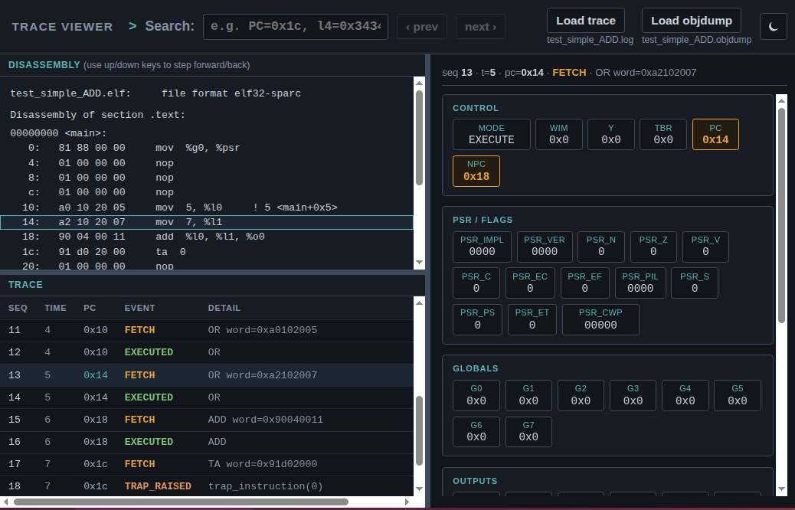

# Logging

Logging plays an important role in working with this model. It's how you
watch a program execute instruction by instruction (see
[Getting Started](getting_started.md)), confirm a timing change actually
took effect (see [Performance Modeling](performance_modeling.md)), or
work out why a test is failing without single-stepping a debugger. This
page covers how logging is actually put together across both models, how
to narrow it down to just the part of a run you care about, and how to
explore the resulting trace in the bundled log viewer.

---

## The current scheme

`SparcCore` owns a `CoreLogger` (`SparcCore::logger`). There is one per
core instance, not per driver. Both `cpp_model` and `sitar_model` drive
the same `SparcCore`, so both produce the *identical* trace format from
it, one tab-separated row per architectural event (fetch, trap, memory
access) with the entire current-window state. This is viewable the same
way in the log viewer, regardless of which model produced it. See
"The log viewer" below and `model/cpp_common_code/CoreLogger.h`.

A driver uses `CoreLogger` one of two ways.

- **`do_print=true`** (`cpp_model/src/sparc_sim.cpp`)  
    `CoreLogger` writes each row directly to a given `ostream` itself.
- **`do_print=false`** (`sitar_model`)  
    Each `log_*()` call just returns the formatted row. The caller
    (`SparcThread.sitar`) forwards it into Sitar's own `log<<` mechanism
    instead of writing it directly.

That second path is where Sitar's own per-module logging comes in. Every
Sitar module or procedure owns a `sitar::logger`, unrelated to
`CoreLogger`. This is Sitar's own class, see
[Sitar's Logging documentation](https://sitar-sim.github.io/sitar/3_language_and_examples/logging.html)
for the full mechanism. It can be pointed at:

- **A common stream**  
    Sitar's own default. `setHierarchicalOstream(TOP, stream)` (see
    `sparc_sim.cpp`) points every module or procedure's logger at
    the same `ostream`, so everything ends up interleaved together in one
    place.
- **A per-module stream**  
    Points just one procedure's `.log` at its own dedicated `ostream`.
    This is what `sparc_sim.cpp` does for `sparcThread`
    specifically. `sparcThread.log.setOstream(&sparcTraceFile)`, plus
    `useDefaultPrefix=false` and `setPrefix("")` to drop Sitar's own
    `(time)hierarchicalId:` prefix, gives `sparcThread`'s own trace: pure
    `CoreLogger` rows, nothing else, a clean file completely separate
    from `mainMemory` and the `MemoryInterface` instances' own messages
    (`sitar.log`). See `model/system_models/core_only/sitar_model/README.md`.

Both models name that trace file after the hex file's own basename, with
the trailing `.hex` replaced by `.log` (`test_simple_ADD.hex` produces
`test_simple_ADD.log`, written into the current directory). Running a
different test right after doesn't clobber the previous one's trace, the
way a single fixed filename would.

---

## Compile-time on/off

Two macros are tied to the same `--logging` flag. Every configuration's
`cpp_model/build.sh` and `sitar_model/build.sh` both expose it (the
latter forwarding to the shared `build_scripts/build_sitar_model.py`).
`--logging` passes `--cflags=-DSPARC_LOGGING_ENABLED` through to `sitar
compile` alongside Sitar's own `--logging`, so one flag controls both.

- **`SPARC_LOGGING_ENABLED`**  
    Gates `CoreLogger`. Without it (the default), every `log_*()` method
    compiles down to a trivial `return "";` stub. None of the
    state-collection or formatting code exists in the binary at all, not
    just skipped at runtime. See `CoreLogger.h`'s file comment.
- **`SITAR_ENABLE_LOGGING`**  
    Gates Sitar's own `sitar::logger` class the same way (see
    `sitar_logger.h` in the separate `sitar` repo).

This is why logging is a rebuild, not a runtime flag. Formatting the
entire current-window state (~50 fields) on every single instruction is
real, non-negligible cost, and a `--no-logging` build pays literally none
of it.

---

## Selective on/off at runtime

Even within a `--logging` build, you don't have to log everything.
Sitar's `sitar::logger` has runtime `turnON()`/`turnOFF()`/`isON()`
methods, checked on every `log<<` call. They're cheap to toggle as often
as you like (see Sitar's own Logging documentation, linked above, for the
full mechanism).

A commented-out example of this lives in `Core.sitar`: a fourth branch in the
top-level parallel block, alongside `sparcThread`, `mainMemory`, and the
halt-detection monitor, that turns `sparcThread.log` on and off each
cycle based on both simulated time and PC. Copy it out and adjust the two
conditions to your own needs:

```sitar
||
	do
		wait until (this_phase==0);
		$
		bool inTimeWindow = current_time.cycle() >= 1000 && current_time.cycle() < 2000;
		bool inPCRange    = sparcThread.core.reg.R_PC() >= 0x2000 && sparcThread.core.reg.R_PC() < 0x2100;
		if (inTimeWindow && inPCRange)
			sparcThread.log.turnON();
		else
			sparcThread.log.turnOFF();
		$;
		wait(1,0);
	while (1) end do;
```

!!! note "Don't drop the `wait(1,0)`"
    It matters more than it looks. Without it, this loop never lets
    simulated time actually advance. `wait until (cond)` returns
    immediately once `cond` is already true, which it still is on the
    very next iteration, with nothing else in the loop to change that.
    So it spins at the same simulated instant forever, and hits Sitar's
    iteration-limit safety net almost immediately. One cycle is plenty,
    this only needs to re-check once per cycle.

Since this toggles `sparcThread.log` itself, it narrows the trace file
down directly. Rows outside the window or range are simply never
written, not filtered out afterward, turning a long run's trace into
something small and targeted enough to load into the log viewer right
away.

The condition above still has to be decided in advance and built into
`Core.sitar`. For a condition that depends on the program's own data at
runtime, a register or memory location reaching a specific value, see
[Examining Core State at Runtime Using GDB](examining_core_state_with_gdb.md)
instead.

---

## The log viewer

A single, self-contained HTML file, `log_viewer/viewer.html`, explores a
trace. It needs no build step and no server, and works entirely offline.
Open it directly in any browser.

It has three independently resizable panels.

- **Disassembly**  
    The `.objdump` of the program under test, so you can see the actual
    instructions alongside their addresses.
- **Trace**  
    One row per architectural event (`FETCH`, `EXECUTED`, `TRAP_RAISED`,
    `MEM_READ`, and so on), color coded by event type.
- **State**  
    The full processor state at whichever row is currently selected:
    control fields (PC, nPC, WIM, Y, TBR), PSR flags, and all four
    register groups (globals, outputs, locals, inputs).

Click a row in Trace to select it and see its state there. Click a line
in Disassembly to jump to the first Trace row at that address. Use the
Up/Down arrow keys to step through the trace row by row, regardless of
any search. The search box (`field=value`, for example `PC=0x1c` or
`l4=0x3434`) filters to matching rows, `prev`/`next` step through them.

**[Try the log viewer here](log_viewer/viewer.html?trace=test_simple_ADD.log)**,
preloaded with a small sample trace (from the bundled `test_simple_ADD`
example) so you can explore it right away, no build required.

<p align="center">
  <a href="log_viewer/viewer.html?trace=test_simple_ADD.log">
    
  </a>
</p>

To view a trace of your own, open `log_viewer/viewer.html` from your own
clone instead, and use its `Load trace`/`Load objdump` buttons (top
right) to pick a trace file you produced yourself (see "Compile-time
on/off" above) and its matching `.objdump`. See
`log_viewer/README.md` for the full reference, including how to serve it
locally so a fresh trace auto-loads from a URL, the same way the embedded
copy above does.
