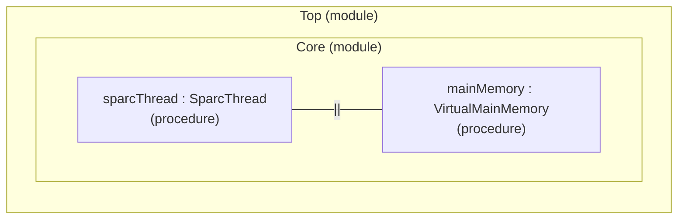
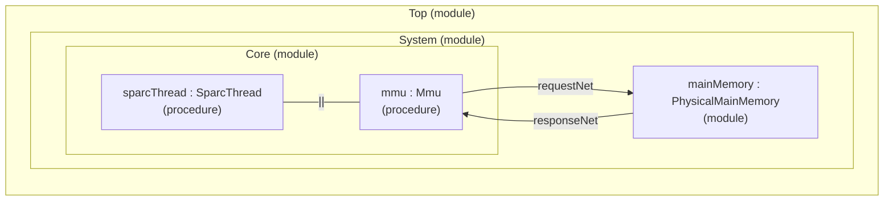

---
hide:
  - toc
---

# Model Configurations

This project provides several system configurations.

- **`core_only`**  
    Models only the SPARC core connected to main memory. Every
    processor-generated address (a virtual address) is used directly
    to index into main memory, with no translation.
- **`core_mmu`**  
    Adds a Memory Management Unit (MMU) between the core and main
    memory. Every processor-generated virtual address is translated to
    a physical address before it reaches main memory.
- **`core_mmu_devices`** (planned)  
    Adds a timer, an interrupt controller, and a serial device.
- **`core_l1cache_mmu_devices`** (planned)  
    Adds split instruction and data L1 caches between the core and the
    MMU.

For each configuration, there exist two implementations:

- **`cpp_model`**  
    A 0-delay functional model. A plain host C++ function-call chain
    through the model's components, with no notion of cycles or
    timing.
- **`sitar_model`**  
    A cycle-timed model. The same components, driven through Sitar
    with real per-opcode, interconnect, and memory timing.

The configurations and their path in the project (linked) are
summarized here:

| Configuration | Type | Description |
|---|---|---|
| core_only | [cpp (functional model)](../../model/system_models/core_only/cpp_model/) | The core plus main memory. No MMU, devices, or caches. |
| core_only | [sitar (timing model)](../../model/system_models/core_only/sitar_model/) | The core plus main memory. No MMU, devices, or caches. |
| core_mmu | [cpp (functional model)](../../model/system_models/core_mmu/cpp_model/) | Adds an MMU between the core and main memory. |
| core_mmu | [sitar (timing model)](../../model/system_models/core_mmu/sitar_model/) | Adds an MMU between the core and main memory. |

For each configuration, both the cpp and sitar models include the same
components: `core_mmu`'s MMU, for example, is present in both its
`cpp_model` and its `sitar_model`, just reached with 0 added delay in
the former and real Sitar timing in the latter.

See [Model Components](model_components.md) for the list of all
components, such as the SPARC Core, the MMU, and devices, that are
included in this project.

---

## Sitar Model Structure

For specifically the Sitar models, which have a notion of structure and
timing, this section describes the structure and component
interconnections for each configuration, as well as the code
structure.

### Configuration: core_only

#### Structure diagram

No net crossing anywhere. The core talks directly to memory over a
procedure handshake, so zero delay communication is possible between
the core and memory procedures. The "--||--" symbol indicates direct
communication between the two procedures using a handshake and shared
variables.

#### Model description

This shows component instance ownership: which design unit
instantiates which, and how many instances.

<pre>
<a href="../../model/system_models/core_only/sitar_model/src/Top.sitar">Top</a>
 |
 +-- <a href="../../model/system_models/core_only/sitar_model/src/Core.sitar">Core</a> (module)
      |
      +-- sparcThread : <a href="../../model/sitar_component_models/SparcThread.sitar">SparcThread</a> (procedure)
      |    |
      |    +-- 5x <a href="../../model/sitar_component_models/VirtualMainMemoryInterface.sitar">VirtualMainMemoryInterface</a> (procedure)
      |
      +-- mainMemory : <a href="../../model/sitar_component_models/VirtualMainMemory.sitar">VirtualMainMemory</a> (procedure)
</pre>

---

### Configuration: core_mmu

#### Structure diagram

The core talks to the MMU over the same procedure handshake `core_only`
uses. The MMU talks to physical memory over two nets, since
`PhysicalMainMemory` is a module, not a procedure. Crossing a net costs
Sitar's own unavoidable minimum one cycle each way, so even at every
knob's default this configuration cannot reach a fully 0-delay run the
way `core_only` can.

#### Model description

This shows component instance ownership: which design unit
instantiates which, and how many instances.

<pre>
<a href="../../model/system_models/core_mmu/sitar_model/src/Top.sitar">Top</a>
 |
 +-- <a href="../../model/system_models/core_mmu/sitar_model/src/System.sitar">System</a> (module)
      |
      +-- core : <a href="../../model/system_models/core_mmu/sitar_model/src/Core.sitar">Core</a> (module)
      |    |
      |    +-- sparcThread : <a href="../../model/sitar_component_models/SparcThread.sitar">SparcThread</a> (procedure)
      |    |    |
      |    |    +-- 5x <a href="../../model/sitar_component_models/VirtualMainMemoryInterface.sitar">VirtualMainMemoryInterface</a> (procedure)
      |    |
      |    +-- mmu : <a href="../../model/sitar_component_models/Mmu.sitar">Mmu</a> (procedure)
      |         |
      |         +-- 2x <a href="../../model/sitar_component_models/PhysicalMainMemoryInterface.sitar">PhysicalMainMemoryInterface</a> (procedure)
      |              |
      |              +-- <a href="../../model/sitar_component_models/PullAToken.sitar">PullAToken</a> / <a href="../../model/sitar_component_models/PushAToken.sitar">PushAToken</a> (procedure)
      |
      +-- mainMemory : <a href="../../model/sitar_component_models/PhysicalMainMemory.sitar">PhysicalMainMemory</a> (module)
           |
           +-- <a href="../../model/sitar_component_models/PullAToken.sitar">PullAToken</a> / <a href="../../model/sitar_component_models/PushAToken.sitar">PushAToken</a> (procedure)

core.requestOut  --requestNet-->  mainMemory.requestIn
core.responseIn  <-responseNet--  mainMemory.responseOut
</pre>

---

## Configuration: core_mmu_devices (planned)

Adds a timer, an interrupt controller, and a serial device as further
sibling submodules of `System`, each reached over its own net pair
through a shared bus. See `Plan_Devices_integration.md`.

---

## Configuration: core_l1cache_mmu_devices (planned)

Adds split instruction and data L1 caches between the core and the MMU.
See `Plan_Caches_integration.md`.
