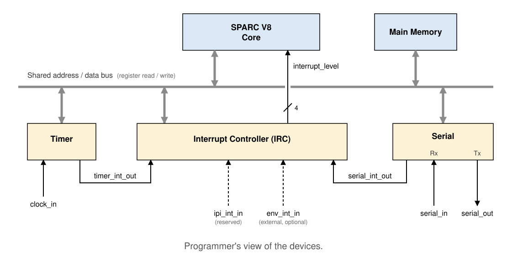

---
hide:
  - toc
---

# Peripheral Devices

## Overview

The purpose of the peripheral devices modeled here is to include a bare
minimum set of devices that make the model realistic, and sufficient
to port a basic operating system on top of it.

- **[Timer](peripheral_devices_timer.md)**  
    A countdown timer, used for generating periodic interrupts, the
    kind an OS uses for context switching.
- **[Interrupt Controller](peripheral_devices_interrupt_controller.md)**  
    Arbitrates and delivers hardware interrupts to the core.
- **[Serial Device](peripheral_devices_serial_device.md)**  
    A single device for I/O.

The register formats, addresses, and behavior documented here are
credited to the [AJIT processor
documentation](https://github.com/adhuliya/ajit-toolchain/blob/marshal/docs/processor/ajit_processor_description.pdf),
Chapter 8, "Basic peripherals available for AJIT systems". The device
models in this project are designed to be compatible with it, except
for the deviations listed at the end of this page.

---

## Connection diagram

A programmer's view of how the devices connect.

Every device has device registers that can be read and written over
the same shared address/data bus the core uses for main memory. Each
device also has its own individual signal pins, unrelated to the bus:

- **Timer**: a `clock_in` input, and a `timer_int_out` output to the
  Interrupt Controller.
- **Serial Device**: `serial_in`/`serial_out` pins, and a
  `serial_int_out` output to the Interrupt Controller.
- **Interrupt Controller**: `timer_int_out`/`serial_int_out` inputs,
  two further reserved inputs (`ipi_int_in`, for a future multi-core
  extension, and `env_int_in`, for an external interrupt source not
  modeled by any device here), and one `interrupt_level` output to the
  core.

---

## Device address map

All addresses are doubleword-aligned. Both `lda`/`sta` with the MMU
bypass ASI (`0x20`, see Appendix I of the SPARC V8 manual) and an
ordinary translated access work, since device pages are identity
mapped.

| Device : Register | Address | Access type | Instruction example |
|---|---|---|---|
| Interrupt Controller : Control | `0xFFFF3000` | word (32-bit) | `sta %rs, [%rd] 0x20` |
| Timer : Control | `0xFFFF3100` | word (32-bit) | `sta %rs, [%rd] 0x20` |
| Serial : Control | `0xFFFF3200` | word (32-bit) | `sta %rs, [%rd] 0x20` |
| Serial : Baud limit / baud control | `0xFFFF320c` | word (32-bit) | `sta %rs, [%rd] 0x20` |
| Serial : Tx | `0xFFFF3210` | byte (8-bit) | `stub %rs, [%rd] 0x20` |
| Serial : Baud frequency | `0xFFFF3210` (shared with Tx, see note) | word (32-bit) | `sta %rs, [%rd] 0x20` |
| Serial : Rx | `0xFFFF3220` | byte (8-bit) | `ldub [%rd] 0x20, %rs` |

`%rd` holds the register's address, loaded with `set` beforehand.

!!! note "Tx and baud-frequency share an address"
    The Serial Device's Tx register and its baud-frequency register
    are both mapped to `0xFFFF3210`. They are distinguished by access
    width, not address: a byte-width access (`stub`) writes a
    character to Tx, a word-width access (`sta`) writes the
    baud-frequency register. This is intentional sharing of an
    address, not an error. See the Serial Device page for the
    baud-rate register format.

---

## Interrupt levels

| Source | IRL | Priority |
|---|---|---|
| Timer | 10 | Highest |
| IPI (reserved for a future multi-core extension) | 11 | |
| Serial | 12 | |
| Env (external, not modeled by any device here) | 14 | Lowest |

The per-core Interrupt Controller priority-encodes its active,
unmasked sources by IRL: the lowest IRL number among them wins. See
the Interrupt Controller page for the masking behavior.

---

## Deviations from the AJIT Processor

None yet. This section will be populated as deviations are introduced
during implementation.
