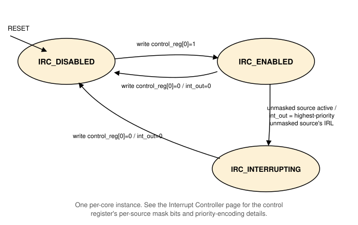

# Interrupt Controller

A per-core Interrupt Controller (IRC). Each core has its own instance:
its own control register, its own state, and its own `interrupt_level`
output pin to that core. It has four interrupt input pins, and
communicates with the core over the shared address/data bus. See
[Peripheral Devices](peripheral_devices.md) for the connection diagram
and the full address map.

## Interrupt sources

| Pin | Source | IRL | Status here |
|---|---|---|---|
| `timer_int_out` | [Timer](peripheral_devices_timer.md) | 10 | Modeled |
| `ipi_int_in` | A future multi-core orchestrator | 11 | Reserved, unconnected |
| `serial_int_out` | [Serial Device](peripheral_devices_serial_device.md) | 12 | Modeled |
| `env_int_in` | An external interrupt source, not modeled by any device here | 14 | Reserved, may be tied to zero or connected to a future external-interrupt-source model |

## Control register

The mask field's bit positions match each source's own IRL, the same
convention used to encode the active-interrupt vector: masking a
source is a plain bitwise AND between the two.

| Bits | Field | Description |
|---|---|---|
| `[0]` | Enable | Writing 1 enables the IRC. Writing 0 disables it and clears `interrupt_level`. |
| `[10]` | Timer mask | If set, the Timer's interrupt is recognized. |
| `[11]` | IPI mask | Reserved. If set, a pending IPI is recognized (unused until a multi-core orchestrator exists). |
| `[12]` | Serial mask | If set, the Serial Device's interrupt is recognized. |
| `[14]` | Env mask | If set, the Env pin's interrupt is recognized. |
| all other bits | Reserved | Unused. |

On a register read, the format above (excluding bit 0) is echoed back
as the currently active, unmasked interrupt sources, not the mask
itself, letting software distinguish "masked but idle" from "active."

## Priority

When more than one unmasked source is active at once, the IRC picks
the lowest IRL number: **Timer (10) > IPI (11) > Serial (12) > Env
(14)**.

## Behavior

- **`IRC_DISABLED`**  
    The reset state. `interrupt_level` is 0. A write of the enable bit
    moves to `IRC_ENABLED`.
- **`IRC_ENABLED`**  
    Watches the four input pins. As soon as any unmasked source is
    active, `interrupt_level` is set to that source's IRL (the
    highest-priority one, if more than one is active at once), and the
    IRC moves to `IRC_INTERRUPTING`.
- **`IRC_INTERRUPTING`**  
    `interrupt_level` stays asserted until the CPU disables the IRC.

A write that clears the enable bit, from any state, immediately clears
`interrupt_level` and moves to `IRC_DISABLED`.

## A future multi-core extension

This page describes a per-core IRC, sufficient on its own for a
single-core system: the `ipi_int_in` pin is simply never driven, and
the IRC works exactly as described above.

A later multi-core extension is expected to add a separate, single
shared orchestrator instance (not modeled here), responsible for
chip-level interrupt mapping, masking, and control, and for the
inter-processor-interrupt (IPI) mechanism itself. Its output would
connect into each per-core IRC's `ipi_int_in` pin, the same way the Timer
and Serial Device connect today, not replace or wrap the per-core IRC
in any way. When that shared orchestrator is absent or disabled, each
core's IRC continues to operate entirely on its own, exactly as
described on this page.
