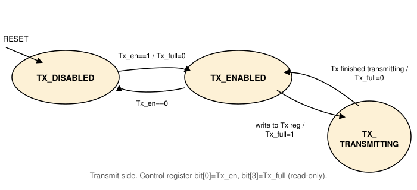
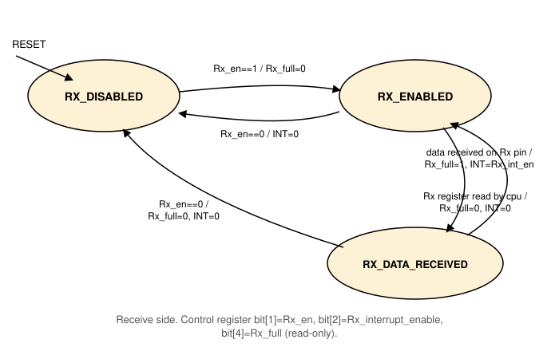

# Serial Device

A memory-mapped serial device (UART) that exchanges bytes between the
core and an external I/O device. It has `serial_in`/`serial_out`
pins, a `serial_int_out` output pin to the [Interrupt
Controller](peripheral_devices_interrupt_controller.md) (IRL 12), and
communicates with the core over the shared address/data bus through
its own set of registers. See [Peripheral
Devices](peripheral_devices.md) for the connection diagram and the
full address map.

A single instance is modeled. A self-tuning variant, which
auto-detects baud rate from an initial calibration byte, is not used
here.

## Registers

| Register | Width | Access |
|---|---|---|
| Control | 32-bit | word only (`ld`/`st`) |
| Tx | 8-bit | byte only (`ldub`/`stub`) |
| Rx | 8-bit | byte only (`ldub`/`stub`) |
| Baud limit / baud control | 32-bit | word only |
| Baud frequency | 32-bit | word only, shares Tx's address (see note below) |

See [Peripheral Devices](peripheral_devices.md#device-address-map) for
the address of each register.

!!! warning "Access width, not just address, must be respected"
    The control register must be accessed with word load/stores. Tx
    and Rx must be accessed with byte load/stores. This is not just a
    style convention: the same address is a byte access to Tx or a
    word access to the baud-frequency register, discriminated purely
    by access width. Using the wrong width does not just fail, it
    silently targets a different register.

### Control register bit-fields

| Bit | Field | Description |
|---|---|---|
| `[0]` | `Tx_en` | Transmit enable. |
| `[1]` | `Rx_en` | Receive enable. |
| `[2]` | `Rx_interrupt_enable` | If set, receiving a byte raises an interrupt. |
| `[3]` | `Tx_full` (read-only) | Set once the CPU writes Tx, cleared once it is transmitted. |
| `[4]` | `Rx_full` (read-only) | Set once a byte is received into Rx, cleared once the CPU reads it. |

## Baud rate

The baud-limit and baud-frequency registers are computed from a
desired baud rate and clock frequency, from the GCD of 16 times the
baud rate and the clock frequency:

```
gcd            = GCD(16 x baud_rate, clock_frequency)
baud_frequency = (16 x baud_rate) / gcd
baud_limit     = (clock_frequency / gcd) - baud_frequency
```

## Behavior

The device is modeled by two independent state machines, transmit and
receive, sharing the one control register above.

### Transmit

- **`TX_DISABLED`**  
    The reset state. A write of `Tx_en=1` clears `Tx_full` and moves
    to `TX_ENABLED`.
- **`TX_ENABLED`**  
    Waits for a Tx register write. On one, `Tx_full` is set and the
    device moves to `TX_TRANSMITTING`.
- **`TX_TRANSMITTING`**  
    Once the byte finishes transmitting, `Tx_full` is cleared and the
    device returns to `TX_ENABLED`.

A write of `Tx_en=0` from any state returns to `TX_DISABLED`.



### Receive

- **`RX_DISABLED`**  
    The reset state. A write of `Rx_en=1` clears `Rx_full` and moves
    to `RX_ENABLED`.
- **`RX_ENABLED`**  
    Waits for a byte on the `serial_in` pin. On one, `Rx_full` is set,
    an interrupt is raised if `Rx_interrupt_enable` is set, and the
    device moves to `RX_DATA_RECEIVED`.
- **`RX_DATA_RECEIVED`**  
    Once the CPU reads the Rx register, `Rx_full` and the interrupt
    are cleared and the device returns to `RX_ENABLED`.

A write of `Rx_en=0` from any state clears `Rx_full` and the
interrupt, and returns to `RX_DISABLED`.


