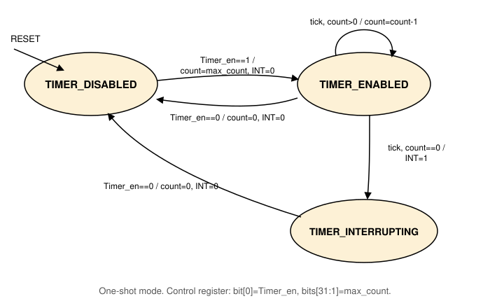

# Timer

A simple countdown timer that operates only in one-shot mode. It has a
`clock_in` input pin, a `timer_int_out` output pin to the [Interrupt
Controller](peripheral_devices_interrupt_controller.md), and
communicates with the core over the shared address/data bus through a
single control register, accessed with word load/stores only. See
[Peripheral Devices](peripheral_devices.md) for the connection diagram
and the full address map.

## Control register

| Bits | Field | Description |
|---|---|---|
| `[0]` | `Timer_en` | Enable bit. Writing 1 starts the countdown, writing 0 disables the timer. |
| `[31:1]` | `Timer_max_count` | The value the count decrements from, set on the same write that enables the timer. |

## Behavior

Software writes a maximum count into the control register and sets
the enable bit in the same write. From that point, the timer
decrements its count by one on every `clock_in` edge. When the count
reaches zero, the timer asserts its interrupt output (IRL 10, see
[Peripheral Devices](peripheral_devices.md#interrupt-levels)) and
stops counting. The interrupt output stays asserted until software
explicitly disables the timer.

- **`TIMER_DISABLED`**  
    The reset state. The interrupt output is 0. A write of
    `Timer_en=1` loads the count with `Timer_max_count` and moves to
    `TIMER_ENABLED`.
- **`TIMER_ENABLED`**  
    Counts down. The interrupt output is 0. When the count reaches 0,
    the interrupt output is asserted, and the timer moves to
    `TIMER_INTERRUPTING`.
- **`TIMER_INTERRUPTING`**  
    The timer stops counting. The interrupt output stays asserted
    until the CPU writes `Timer_en=0`, which clears it and returns the
    timer to `TIMER_DISABLED`.

A write of `Timer_en=0` from any state immediately clears the count
and the interrupt output, and moves to `TIMER_DISABLED`.

## Note

A free running 64-bit counter across ASR[31] and ASR[30], running at
the processor clock and read-only, is documented separately from this
Timer. It is unrelated to it, a CPU-internal cycle counter rather
than a memory-mapped, software-configured countdown timer. Our Sitar
model does not yet implement this counter.
